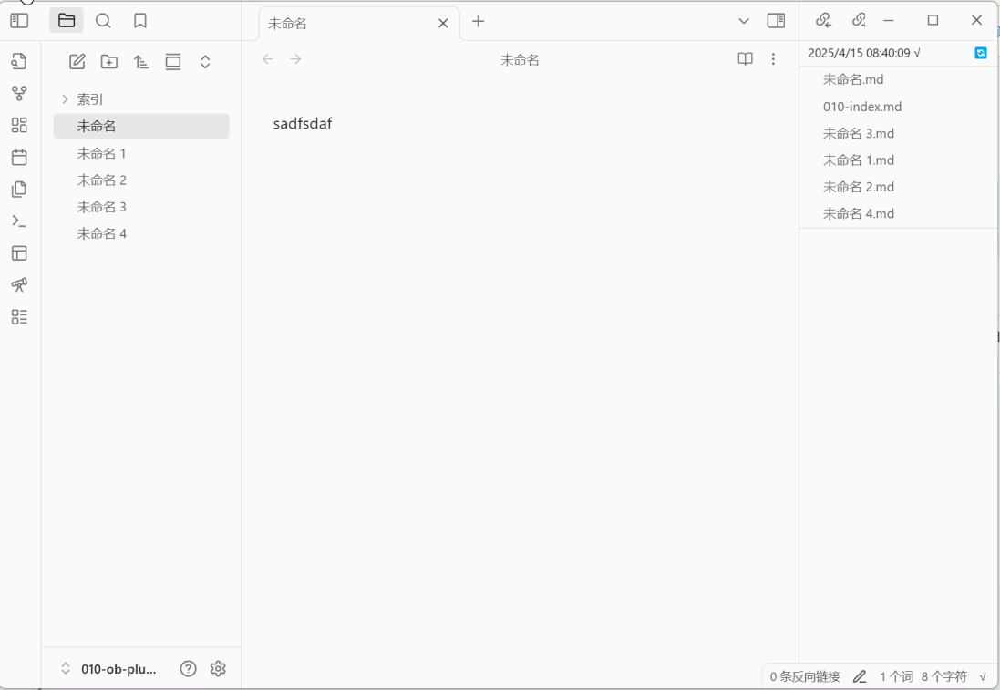
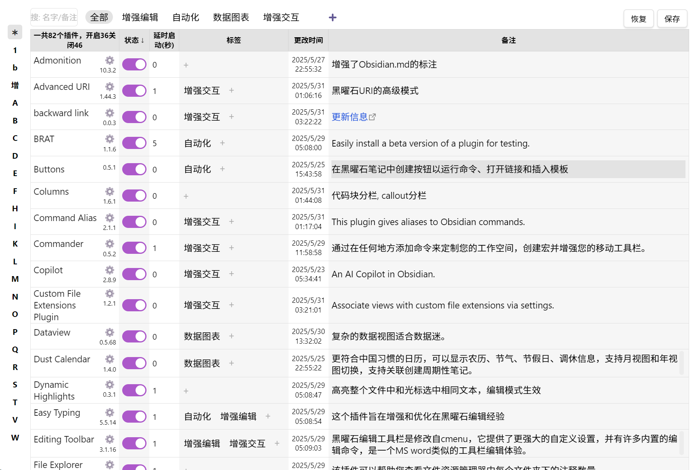

# Watchtower 插件功能介绍

这是一个[obsidian](https://obsidian.md/)插件。旨在增强 Obsidian 的笔记安全功能和使用体验。**笔记监控**与**插件管理**，让我们在笔记中享受更安全、更高效的体验。

## 1. **笔记监控**  

   对笔记基本数据的实时记录，确保笔记的完整性和一致性。解决多设备同步造成的笔记丢失、冲突、误操作删改笔记时。提供一份笔记更改记录，帮助我们及时发现及时解决问题。特别是在大规模批量替换、更改笔记时非常有帮助。另外提供一个最近打开文件的历史记录，当作是一个快速切换笔记的快捷方式。

### 文件监控功能演示

## 2. **插件管理能力**  

obsidian 有着丰富的社区插件生态，这是非常迷人的。但是我们为了一个功能一条命令下载一个插件，不知不觉之中，插件的安装数量很快就到达数十个，部分不常用的功能很难在插件的海洋里面找出来。而且每个插件几乎都有自己独立的设置页面，不同的运行逻辑。有些复杂的设置需要认真研究一下才能弄清楚。下次改动又得耗费精力。如果是语言不通的用户使用感受更加是灾难。这样整个应用使用起来感觉非常破碎。

这个插件管理功能提供了一个全局总揽的视图自定义插件行为，排序、开关，分组、延时启动、备注链接到笔记。

### 插件管理功能演示

