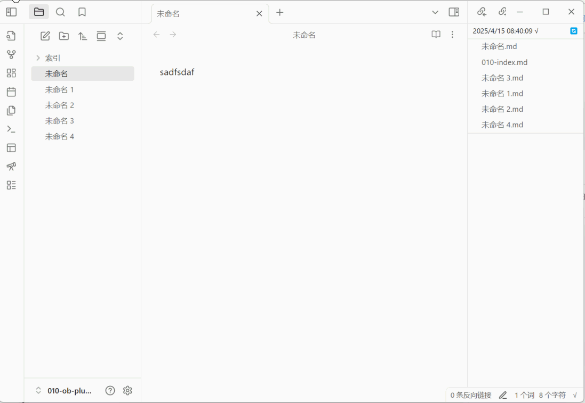
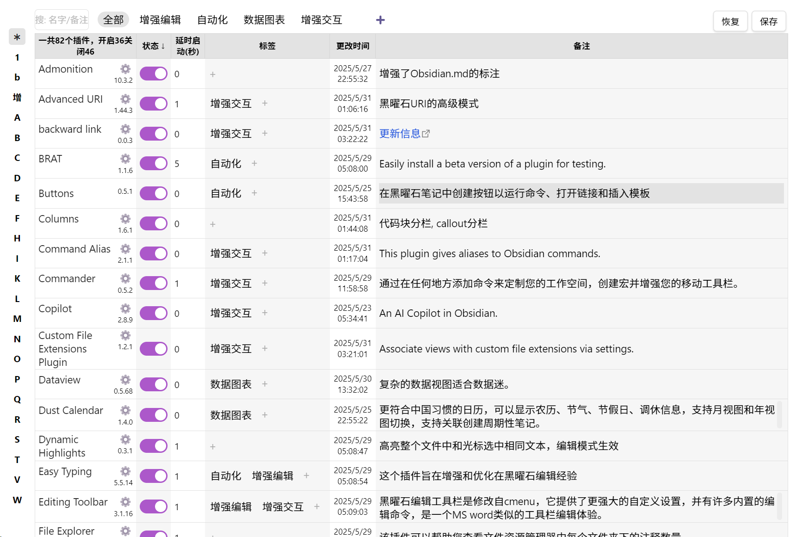

# Watchtower 插件功能介绍

这是一个[obsidian](https://obsidian.md/)插件。旨在增强 Obsidian 的笔记安全功能和使用体验。**文件监控**与**插件管理**，让我们在笔记中享受更安全、更高效的体验。

## 1. **文件监控**

   对笔记基本数据的实时记录，确保笔记的完整性和一致性。在误操作删改笔记、多设备同步造成的文件丢失、冲突时。提供一份文件更改记录，帮助我们及时发现及时解决问题。

   当使用类似Syncthing这种第三方同步方案的时候，切换设备并不会有提示是否同步完成，需要打开同步软件查看同步进度。有了这份文件记录只需要在obsidian里面就可以知道是否同步完成，而不需要打开同步软件了。

### 文件监控功能演示

## 2. **插件管理能力**  

obsidian 有着丰富的社区插件生态，这是非常迷人的。但是我们为了一个功能一条命令下载一个插件，不知不觉之中，插件的安装数量很快就到达数十个，部分不常用的功能很难在插件的海洋里面找出来。而且每个插件几乎都有自己独立的设置页面，不同的运行逻辑。有些复杂的插件设置需要认真研究一下才能弄清楚。下次改动又得耗费精力。如果是语言不通的用户使用感受更加是灾难。这样整个应用使用起来感觉非常破碎。

这个插件管理功能提供了一个全局总揽的视图，可以自定义插件行为：开关、搜索、排序、分组、延时启动、备注、保存和恢复全部插件状态。你可以在备注里面输入markdown语法，链接到笔记或者外部链接。

### 插件管理功能演示

## 3. **插件更新调度器**

自动检查已安装插件的更新，支持自定义检查间隔和任务类型。可在设置中启用或禁用调度器。

- **定时检查更新**：按设定的间隔自动检查所有插件是否有新版本
- **任务管理**：支持添加、删除、暂停、恢复定时任务
- **通知提醒**：发现更新时自动弹出通知

## 4. **命令面板**

通过 Obsidian 命令面板（Ctrl+P）快速执行以下操作：

| 命令 | 说明 |
|------|------|
| 检查所有插件更新 | 扫描所有已安装插件，对比 GitHub 最新版本 |
| 更新指定插件 | 更新有可用更新的插件 |
| 批量更新所有可更新插件 | 一键更新所有有新版本的插件 |
